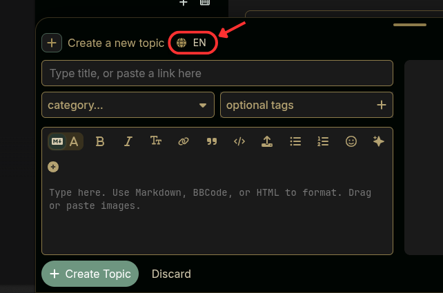

# Discourse Post Locale Auto-Injector

This component ensures that every topic and reply is tagged with a valid language locale (based on the user's interface settings) instead of defaulting to `None`.

### 🛠 Installation
1. Go to **Admin > Customize > Themes**.
2. Click **Install** and select **From the Web**.
3. Paste the URL of this Gist:
   `https://github.com/g0stbit/CI7-DiscoursePostLocaleAutoInjector`
4. Click **Install**.
5. Add the component to your active themes (Main, Dark, etc.).
6. **Refresh your browser page.**
